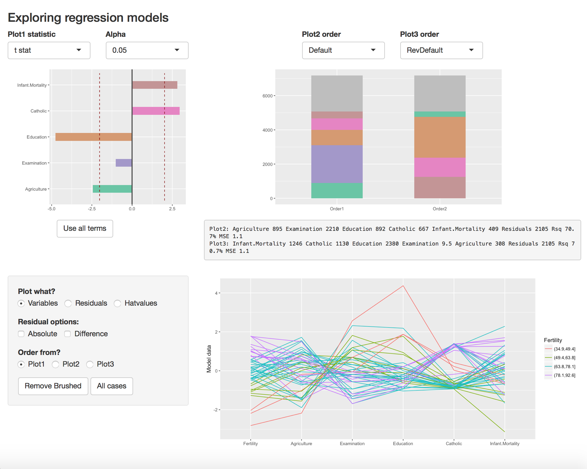

 
<!-- README.md is generated from README.Rmd. Please edit that file -->
ERSA
====

The Exploratory Regression Shiny App (ERSA) package consists of a collection of functions for displaying the results of a regression calculation, which are then packaged together as a shiny app function.

Installation
------------

You can install ERSA from github with:

``` r
# install.packages("devtools")
devtools::install_github("cbhurley/ERSA")
library(ERSA)
```

Usage
-----

This is a basic example which shows you how to solve a common problem:

``` r
## basic example code
```

To use ERSA first do

``` r
library(ERSA)
```

Then construct a regression model of your choice.

``` r
f <- lm(Fertility ~ . , data = swiss)
exploreReg(f,swiss)
```

This opens up a browser through which you can explore the regression model.

Here is a screen shot of the result:



Check out the vignette for more information and details.

Shinyapps.io
------------

To play around with ERSA on another dataset, check out the Shiny app on [check out the Shiny app online](https://mustat.shinyapps.io/ERSAv1/). It uses the hprice1 dataset from the R package wooldridge.
